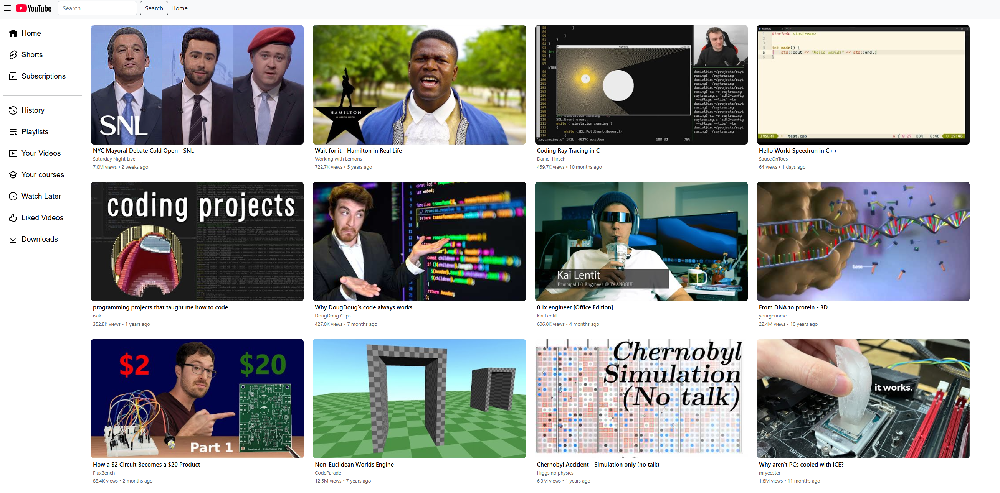

  <h1>YouTube Clone Project</h1>

  

    This project is a web application that mimics YouTube using <strong>Bootstrap</strong> for styling and layout. 
    It uses the <strong>YouTube API</strong> to fetch video data, including thumbnails, titles, and other metadata.
  

  

   

  

  

    <a href="https://jakubmorawa.github.io/YouTube-Clone-Project/">Live Website</a>
  

  

    
  

  <h2>Features</h2>
  <ul style="list-style: none; padding-left: 0; text-align: left; display: inline-block;">
    <li>✅ Responsive YouTube-like layout using Bootstrap</li>
    <li>✅ Fetches video thumbnails and metadata using YouTube API</li>
    <li>✅ Clean and interactive UI</li>
  </ul>

  <h2>Tech Stack</h2>
  <ul style="list-style: none; padding-left: 0; text-align: left; display: inline-block;">
    <li>HTML / CSS / JavaScript</li>
    <li>Bootstrap</li>
    <li>YouTube Data API v3</li>
  </ul>

